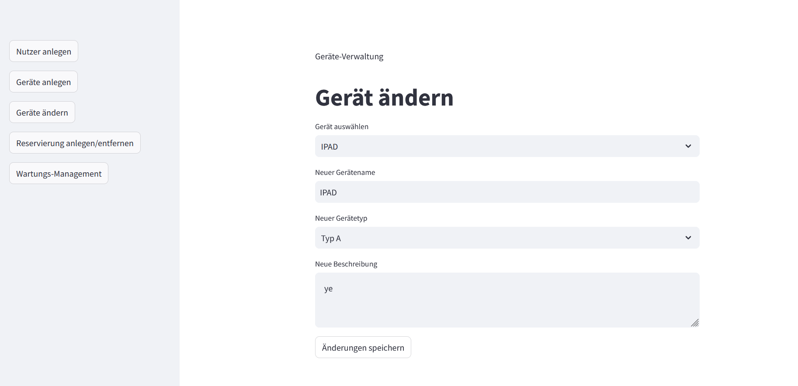
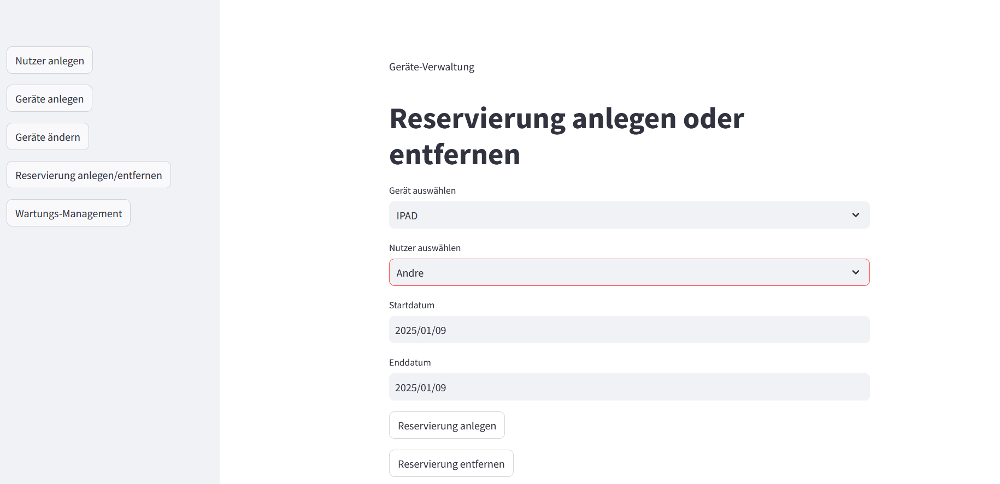

# case_study_I_mockup

# Geräte-Verwaltungs-App

Dieses Projekt bietet eine benutzerfreundliche Oberfläche zur Verwaltung von Geräten, Nutzern und Reservierungen. Es ermöglicht Geräteverwaltung, Nutzerverwaltung, Wartungsplanung und die Erstellung sowie Löschung von Reservierungen.
---

### Voraussetzungen
- **Python 3.8 oder höher**
- Abhängigkeiten aus der Datei `requirements.txt`
---

